# Arithmetic

## Double Trouble

The assignment in this exercise is to create a circuit which will output **1** if at least 2 of the 4 input bits are **1**.

We could check for all possibilities with `AND` gates. But there is a shorter solution:

1. Check if **A** and **B** both are **1**.
2. Check if **C** and **D** both are **1**.
3. Check if either **A** or **B** and **C** or **D** are **1**. Meaning if any of the first two bits are **1** and any of the last two bits are **1** then at least two inputs are **1**, so the condition is fulfilled.
4. Connect all of the previous conditions to an `OR` gate, because if there are more than 2 inputs **1** then we still output **1**.

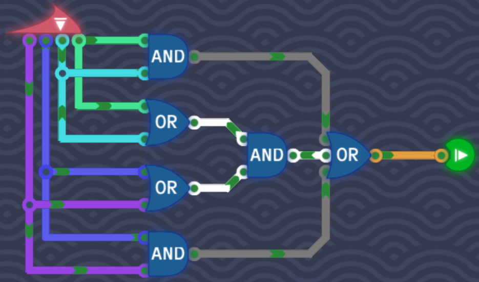

## Odd Number Of Signals

We have to find a way to output **1** only if the active input bits are odd or uneven.

The `XOR` gate only outputs **1** if the inputs are different. This is gate suits perfectly in this level because all we do is checking if we are dealing with an odd or even number of inputs.

So we `XOR` the first two input bits and then `XOR` the last two input bits. This ensures the following:

1. Only **A** is on and **B** is off, or only **B** is on and **A** is off.
2. Only **C** is on and **D** is off, or only **D** is on and **C** is off.

Which means we now have two outputs. If only one of the two outputs is **1**, that means we have a odd number of signals. We can check this by connecting the two outputs to another `XOR` gate:

## Counting Signals

This level requires us to split the problem into smaller problems. We get a binary counter which represents the output. The output should display the number of active signals. For example if **A** is **1** and the remaining 3 input bits are **0**, then the output should be **1**. If **A** and **C** is **1** then the output should be **2** and so on.

### 1's bit (yellow)

Whenever the 1's bit in the output is **1** we know that the number of signals must be odd. So we can apply the same logic as we did in [Odd Number Of Signals](#odd-number-of-signals).

### 2's bit (pink)

For the 2's bit in the output we follow a similar logic as in [Double Trouble](#double-trouble):

1. `XOR` **A** and **B**, then `XOR` **C** and **D**. Then `AND` the two outputs. This checks for the following patterns: `AC`, `BC`, `AD`, `BD`.
2. `AND` **A** and **B**, then `AND` **C** and **D**. Then `XOR` the two outputs. This checks for the following patterns: `AB`, `CD`.

If there are 3 active signals, then [1's bit](#1s-bit) will handle the 1's bit.

### 4's bit (white)

If there are 4 active signals, then all we have to check if **A** and **B** `AND` **C** and **D** are all active. We do this by chaining `AND` gates together.

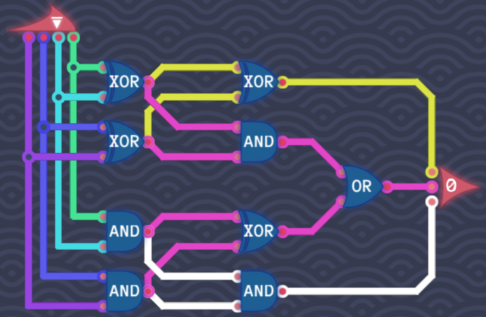

## Double The Number

This time we don't get a sinlge bit input but a byte. A byte consists of 8 bits. We have two new components available: an **Byte Splitter** and an **8 Bit Maker**. The first one splits 1 byte into 8 bits and the second one takes 8 bits and turns it into a byte.

Binary is also called **base 2**. That means each place represents a power of 2 (ones, twos, fours, eights, ...). When we now split the byte into bits and put each bit into the next place in the **8 Bit Maker** we essentialy double each bit. The output will then be the whole number doubled.

The last bit (128) is connected to the first bit (1) to account for overflow.

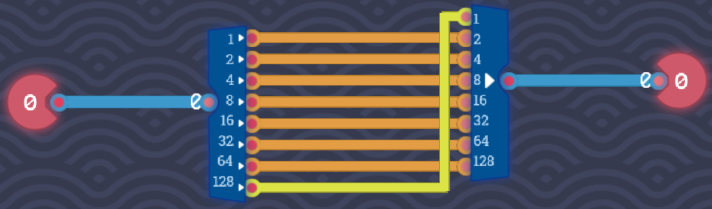

## Half Adder

A half adder is a circuit that allows for adding two single-bit binary numbers and produces two outpus: a **sum** and a **carry**.

The **sum** bit is **1** if either **A** or **B** is **1**. If both **A** and **B** are **1** then the **sum** is **0** and the **carry** is **1** because a binary digit can only represent 2 digits: 0 and 1. So when we add $1 + 1$ then 2 would not be possible to represent in a single binary digit. So we pass it to the **carry**.

Here's the truth table:

### Half Adder Truth Table

| A   | B   | Sum | Carry |
| --- | --- | --- | ----- |
| 0   | 0   | 0   | 0     |
| 0   | 1   | 1   | 0     |
| 1   | 0   | 1   | 0     |
| 1   | 1   | 0   | 1     |

The **sum** emulates the behaviour of an `XOR` gate while the **carry** emulates that of an `AND` gate. We just have to combine the two:

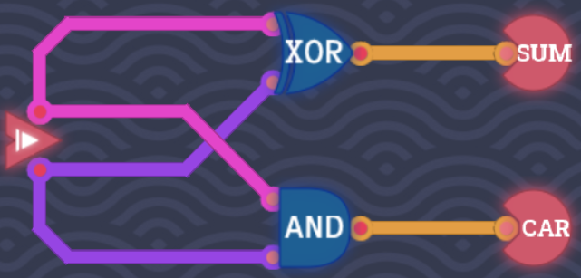

## Full Adder

A full adder is an extension of the [half adder](#half-adder). It takes an additional input bit, which could be used for the carry of another full adder for example.

The logic is the same, but this time we are dealing with 3 inputs. This means we use two `XOR` gates to check if only one input signal is active for the **sum**.

Also we use two `AND` gates to check if 2 input signals are active. If there are, we pass it to the **carry** output.

In case all 3 input signals are active, then **sum** and **carry** output **1**. This is because adding $1 + 1 + 1 = 3$, which is `11` in binary which cannot be represented by a single binary digit.

### Full Adder Truth Table

| A   | B   | C   | Sum | Carry |
| --- | --- | --- | --- | ----- |
| 0   | 0   | 0   | 0   | 0     |
| 1   | 0   | 0   | 1   | 0     |
| 1   | 1   | 0   | 0   | 1     |
| 0   | 0   | 1   | 1   | 0     |
| 1   | 0   | 1   | 0   | 1     |
| 0   | 1   | 1   | 0   | 1     |
| 1   | 1   | 1   | 1   | 1     |

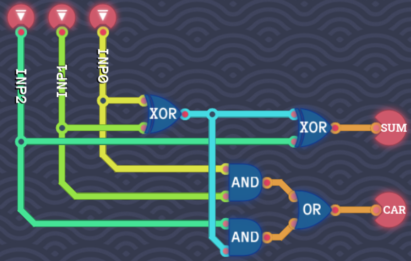

## Byte NOT

We've already created a `NOT` gate but for a single bit. This time, our goal is to implement a `NOT` gate for a byte (8 bits).

The `NOT` gate just inverts the bits. Meaning when we pass a byte to the **Byte Splitter**, any input signal that is **0** will be **1** and any signal that is **1** will be **0**. We just pass each bit through a `NOT` gate and then collect it using the **8 Bit Maker** component.

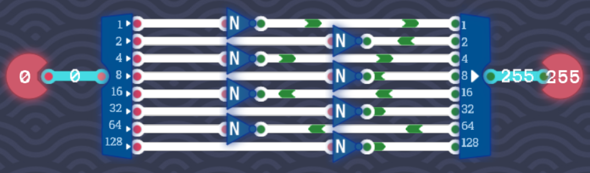

## Byte OR

Likewise, the `OR` gate we built only operates on single bits. When operating with bytes, we have to take the two bytes and split it into bits. Then we compare each bit from the first byte with each bit from the second byte and passing it through the 1-bit `OR` gate. In the end we output the result of all these `OR` operations by converting the bits back to a byte using the **8 Bit Maker** component.

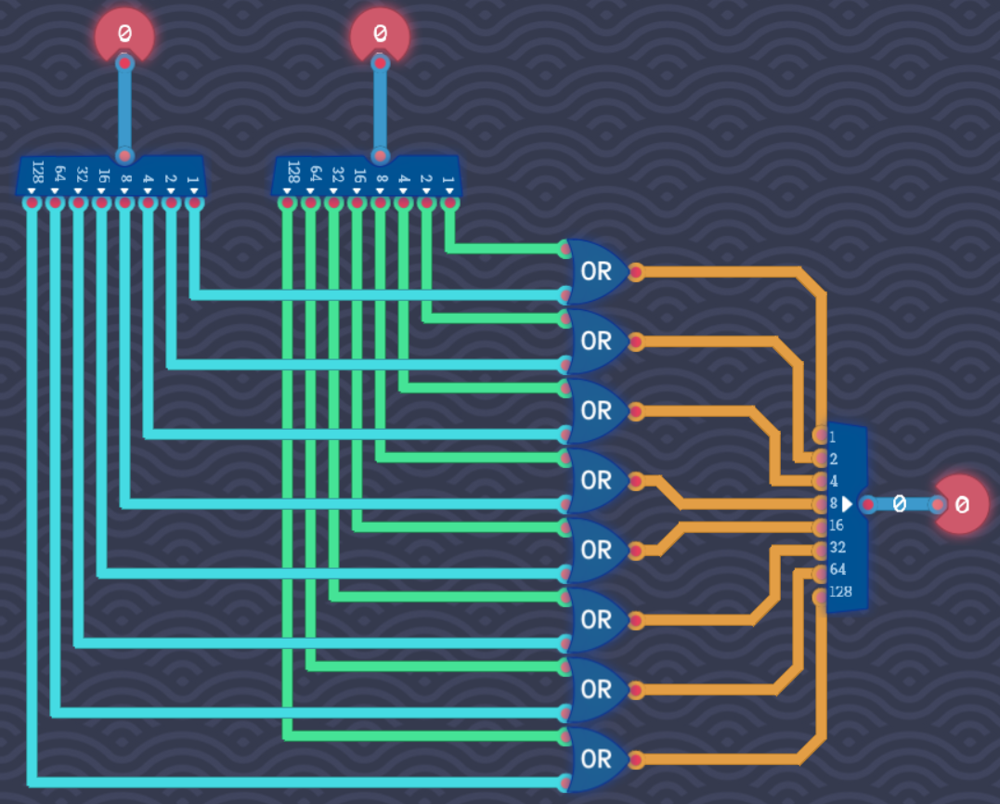

## Adding Bytes

We've created a [Full Adder](#full-adder) which adds together two bits and a carry. We can use this component in this assignment. The goal is to create a full adder that operates on bytes.

As input we get **two bytes** (2 x 8 bits) and a single bit **carry** input. The logic is similar to what we did in the previous few exercises:

1. Take the bytes and split them into bits.
2. Take the carry bit from the input.
3. Add all of the bits together.
4. Pass the **sum** to the **8 Bit Maker**, which converts the 8 bits back into a byte.
5. Pass the **carry** to the next full adder which adds the next two bits of the two numbers.
6. In the end if there is a carry pass it to the **carry output**.

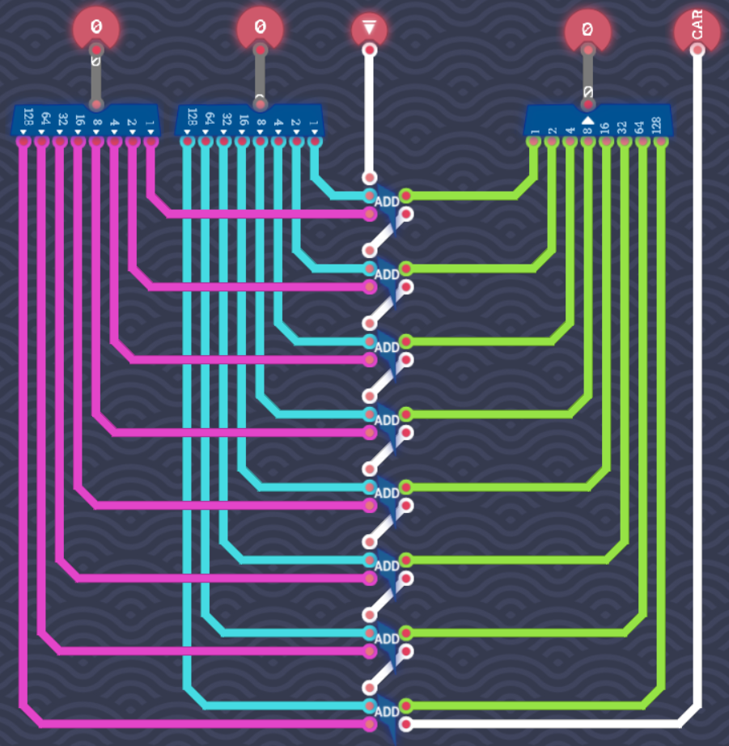

## Signed Negator

Up until now we've been dealing with positive numbers. What if we wanted our computer to represent negative numbers as well? For this we will use [Two's Complement](https://en.wikipedia.org/wiki/Two%27s_complement) which is the most common method of representing signed integers on computers.

Luckily, it's very easy to convert an unsigned integer to a signed integer using Two's Complement method:

1. Invert all bits of the integer.
2. Add 1 bit.

We can do this by using three components we've already built:

1. `NOT` (8 bit)
2. `ON` (returns always **1**)
3. `ADD` (8 bit full adder built in [Adding Bytes](#adding-bytes))

First we invert all the bits of the input with the `NOT` (8 bit) gate. We then pass the inverted byte to `ADD` (8 bit). When we pass `ON` to `ADD`, it's the same as adding **1**. So we basically added **1** to the inverted output of `NOT`.

When input is **2**, output will be **-2** for example.

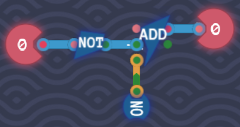

## 1 Bit Decoder

The assignment in this level is to build a 1-bit decoder. A _decoder_ is a circuit that takes a binary input and "decodes\* it into a specific output. In our context, it takes lights up only one single output line depending on the input.

For example:

- If the input is 00, the **first** output line lights up.
- If the input is 01, the **second** output line lights up.
- If the input is 10, the **third** output line lights up.

And so on.

This is ideal to determine specific actions for a specific input.

In this case we want this behaviour:

| In  | Out 1 | Out 2 |
| --- | ----- | ----- |
| 0   | 1     | 0     |
| 1   | 0     | 1     |

In other words: If **Input** is **0**, turn on **Output 1**. If **Input** is **1**, turn on **Output 2**.

## 3 Bit Decoder

This time, we want to encode 3 bits. With 3 bits there are 8 different possibilities:

| In 1 | In 2 | In 3 | Desired bit |
| ---- | ---- | ---- | ----------- |
| 0    | 0    | 0    | 1 (0001)    |
| 1    | 0    | 0    | 2 (0010)    |
| 0    | 1    | 0    | 3 (0011)    |
| 1    | 1    | 0    | 4 (0100)    |
| 0    | 0    | 1    | 5 (0101)    |
| 1    | 0    | 1    | 6 (0110)    |
| 0    | 1    | 1    | 7 (0111)    |
| 1    | 1    | 1    | 8 (1111)    |

There is possibly no other way than to just bruteforce each possible comination. For, this we use `AND` and `NOT` gates.

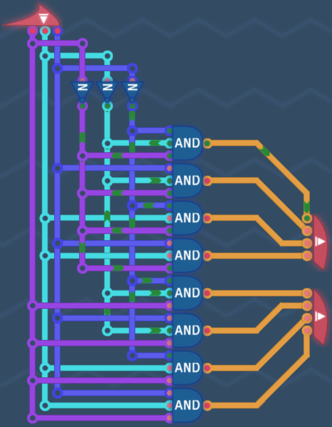

## Logic Engine

In this level we will build a small logic engine. Our engine takes a 2-bit **instruction code** and two bytes as input.

### Instructions

| Code | Instruction |
| ---- | ----------- |
| 00   | `OR`        |
| 01   | `NAND`      |
| 10   | `NOR`       |
| 11   | `AND`       |

Let's take a look at the manual and learn about [De Morgan's Laws](https://en.wikipedia.org/wiki/De_Morgan%27s_laws):

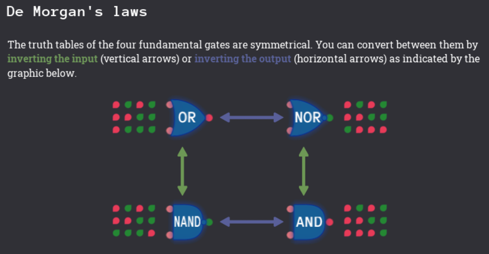

We already have an 8-bit `OR` gate. With this gate we can build all other gates required for the instructions above.

We will also use a new component: The **8 Bit Mux** (8-bit multiplexer).

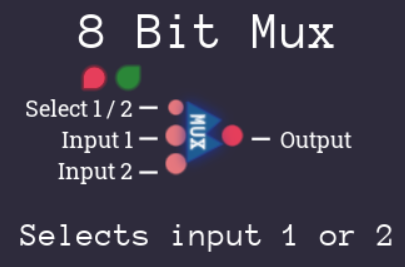

The multiplexer component takes a byte which determines if **Input 1** or **Input 2** will get passed to the output. If this bit is **0** then **Input 1** is chosen, otherwise **Input 2**.

Let's start with the `OR` instruction. This one is easy because we already have the 8-bit `OR` gate:

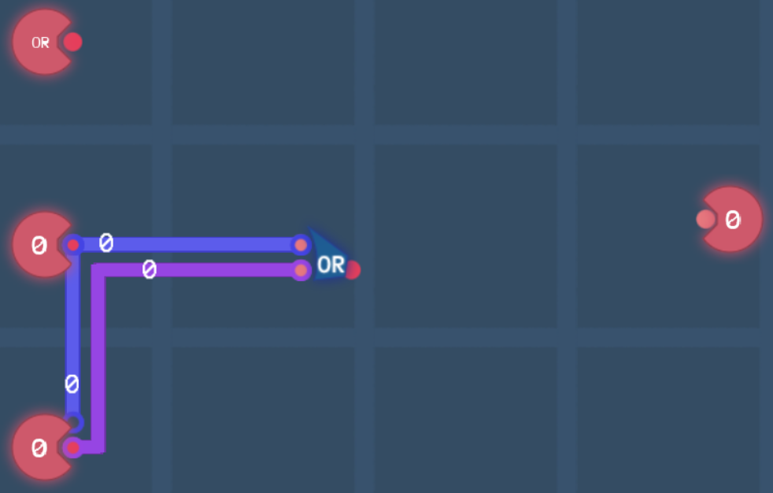

Now we implement the second instruction: `NAND` with a binary code of **01**. De Morgan's laws state that in order to implement a `NAND` gate from an `OR` gate, we just have to invert both of the inputs:

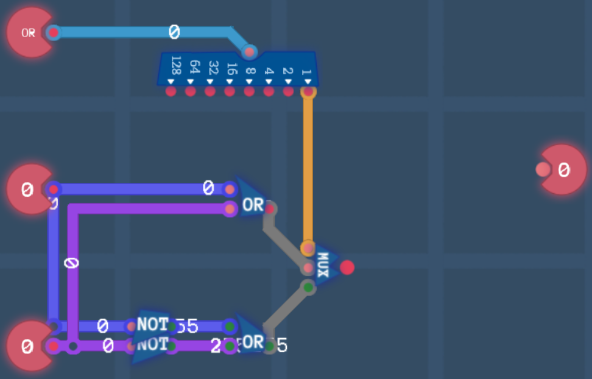

Notice that we now take the instruction byte and split it into bits. If the first bit is **0**, then we want to pass the `OR` gate signal through the **8 Bit Mux**, otherwise if the first bit is **1** we pass the `NAND` signal we just built.

Before we implement the next two instructions, `NOR` and `AND`, let's just pass the signal through another `MUX` if the second instruction bit is **0**. That means the instruction is either `OR` (00) or `NAND` (01) and we just pass the signal:

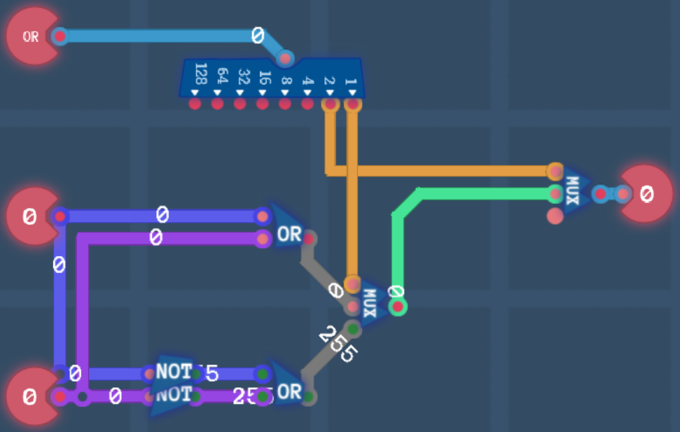

All there is left now is to implement the `NOR` and `AND` instructions. The good news is that this is done through a single signal.

This is because going from `OR` to `NOR` we just invert the output of the `OR` gate. Likewise going from `NAND` to `AND` is again just inverting the output of `NAND`. The first `MUX` already sets the condition for `OR` and `AND`, so all we have to do now is take the output from `MUX` and invert it using a 8-bit `NOT` gate:

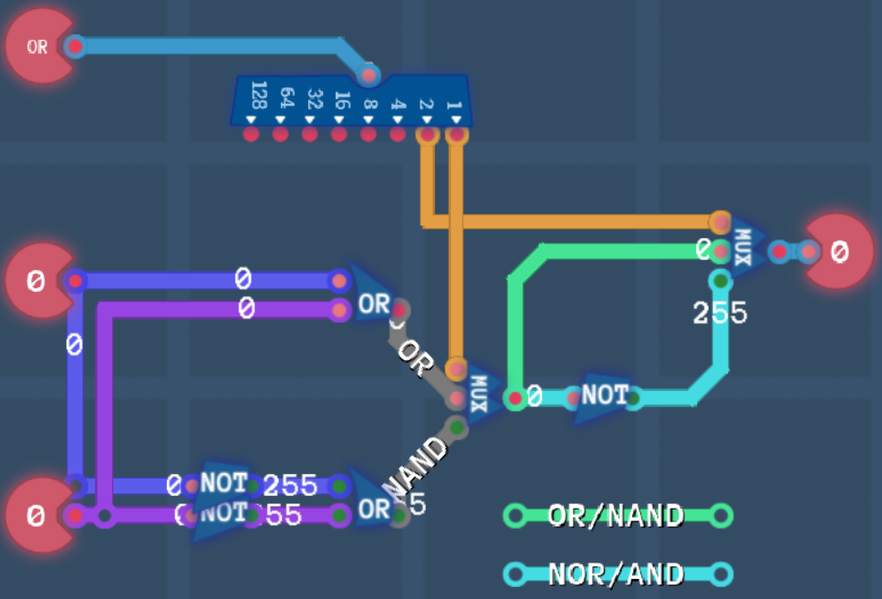
