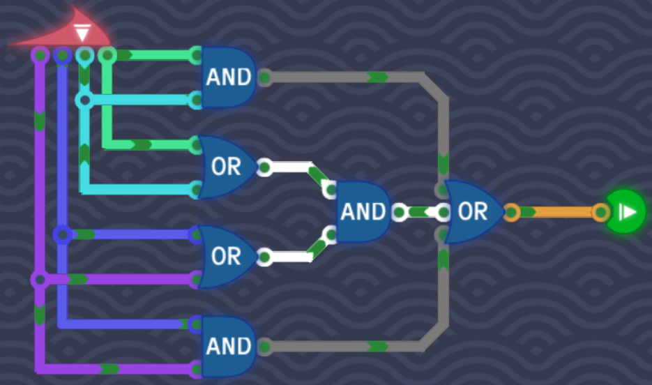
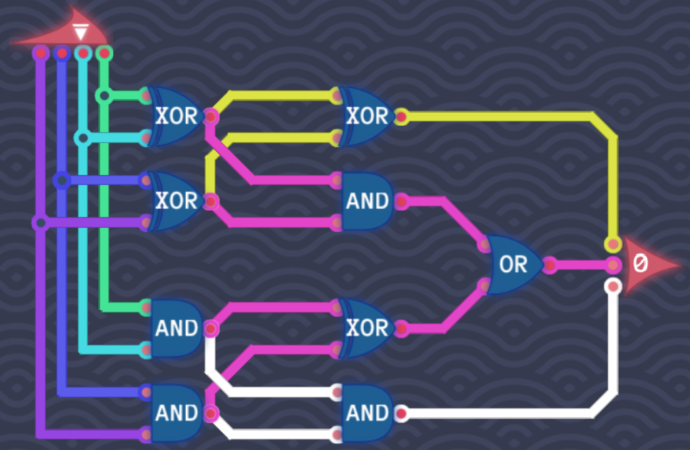
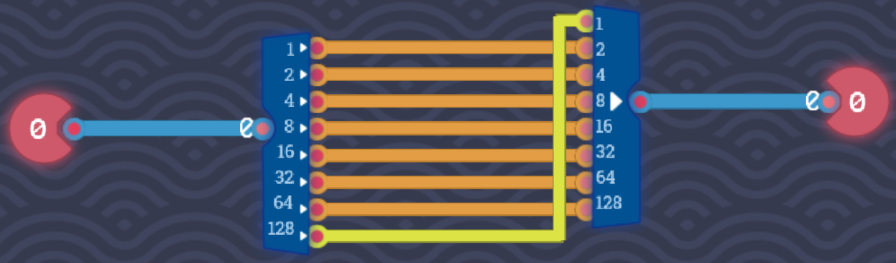
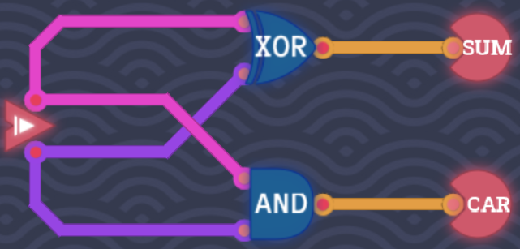

# Arithmetic

## Double Trouble

The assignment in this exercise is to create a circuit which will output **1** if at least 2 of the 4 input bits are **1**.

We could check for all possibilities with `AND` gates. But there is a shorter solution:

1. Check if **A** and **B** both are **1**.
2. Check if **C** and **D** both are **1**.
3. Check if either **A** or **B** and **C** or **D** are **1**. Meaning if any of the first two bits are **1** and any of the last two bits are **1** then at least two inputs are **1**, so the condition is fulfilled.
4. Connect all of the previous conditions to an `OR` gate, because if there are more than 2 inputs **1** then we still output **1**.

## Counting Signals

This level requires us to split the problem into smaller problems. We want get a binary counter which represents the output. The output should display the number of active signals. For example if **A** is **1** and the remaining 3 input bits are **0**, then the output should be **1**. If **A** and **C** is **1** then the output should be **2** and so on.

### 1's bit (yellow)

Whenever the 1's bit in the output is **1** we know that the number of signals must be odd. So we can apply the same logic as we did in [Odd Number Of Signals](#odd-number-of-signals).

### 2's bit (pink)

For the 2's bit in the output we follow a similar logic as in [Double Trouble](#double-trouble):

1. `XOR` **A** and **B**, then `XOR` **C** and **D**. Then `AND` the two outputs. This checks for the following patterns: `AC`, `BC`, `AD`, `BD`.
2. `AND` **A** and **B**, then `AND` **C** and **D**. Then `XOR` the two outputs. This checks for the following patterns: `AB`, `CD`.

If there are 3 active signals, then [1's bit](#1s-bit) will handle the 1's bit.

### 4's bit (white)

If there are 4 active signals, then all we have to check if **A** and **B** `AND` **C** and **D** are all active. We do this by chaining `AND` gates together.

## Double The Number

This time we don't get a sinlge bit input but a byte. A byte consists of 8 bits. We have two new components available: an **8 Bit Splitter** and an **8 Bit Maker**. The first one splits 1 byte into 8 bits and the second one takes 8 bits and turns it into a byte.

Binary is also called **base 2**. That means each place represents a power of 2 (ones, twos, fours, eights, ...). When we now split the byte into bits and put each bit into the next place in the **8 Bit Maker** we essentialy double each bit. The output will then be the whole number doubled.

The last bit (128) is connected to the first bit (1) to account for overflow.

## Odd Number Of Signals

We have to find a way to output **1** only if the active input bits are odd or uneven.

The `XOR` gate only outputs **1** if the inputs are different. This is gate suits perfectly in this level because all we do is checking if we are dealing with an odd or even number of inputs.

So we `XOR` the first two input bits and then `XOR` the last two input bits. This ensures the following:

1. Only **A** is on and **B** is off, or only **B** is on and **A** is off.
2. Only **C** is on and **D** is off, or only **D** is on and **C** is off.

Which means we now have two outputs. If only one of the two outputs is **1**, that means we have a odd number of signals. We can check this by connecting the two outputs to another `XOR` gate:

## Half Adder

A half adder is a circuit that allows for adding two single-bit binary numbers and produces two outpus: a **sum** and a **carry**.

The **sum** bit is **1** if either **A** or **B** is **1**. If both **A** and **B** are **1** then the **sum** is **0** and the **carry** is **1** because a binary digit can only represent 2 digits: 0 and 1. So when we add $1 + 1$ then 2 would not be possible to represent in a single binary digit. So we pass it to the **carry**.

Here's the truth table:

### Half Adder Truth Table

| A   | B   | Sum | Carry |
| --- | --- | --- | ----- |
| 0   | 0   | 0   | 0     |
| 0   | 1   | 1   | 0     |
| 1   | 0   | 1   | 0     |
| 1   | 1   | 0   | 1     |

The **sum** emulates the behaviour of an `XOR` gate while the **carry** emulates that of `AND` gate. We just have to combine the two:

