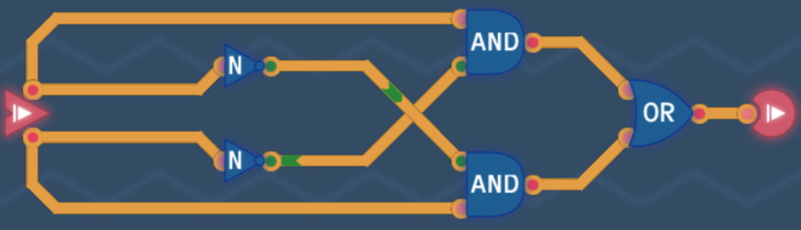
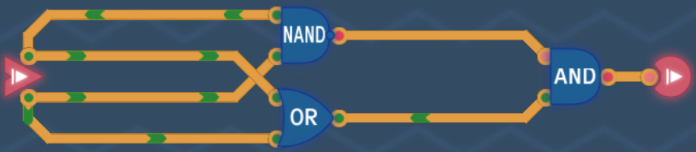
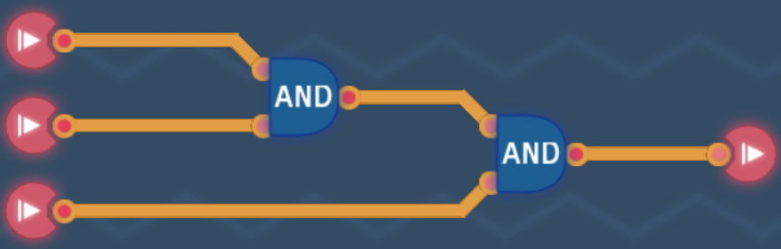

# Basic Logic

## Crude Awakening

> A signal flows from the input to the output.

The first level teaches us that when activating the input, the signal will flow to the output.

## NAND Gate

We learn about the first logic gate! It's called the `NAND` gate. Everything in a computer can be constructed from this gate. In this level we have to find out how the two input bits influence the output.

A `NAND` gate always returns **1** except when both inputs are **1**. This is the truth table:

### NAND Truth Table

| A   | B   | Out |
| --- | --- | --- |
| 0   | 0   | 1   |
| 0   | 1   | 1   |
| 1   | 0   | 1   |
| 1   | 1   | 0   |

## NOT Gate

The `NOT` gate simply inverts the input. So when the input is **0** the output will be **1**. If the input is **1** then the output will be **0**.

We can build a `NOT` gate by connecting the input to the two pins of the `NAND` gate.

### NOT Truth Table

| In  | Out |
| --- | --- |
| 0   | 1   |
| 1   | 0   |

## AND Gate

The `AND` gate is simply an inverted `NAND` gate. That's why it's called `NAND` gate: **NOT** `AND`. So all we have to do is simply inverting the output of `NAND` with a `NOT` gate we obtained in the last level.

### AND Truth Table

| A   | B   | Out |
| --- | --- | --- |
| 0   | 0   | 0   |
| 0   | 1   | 0   |
| 1   | 0   | 0   |
| 1   | 1   | 1   |

## OR Gate

The `OR` gate will always return **1** except if both inputs are **0**. It's basically a mirrored version of the `NAND` gate output. We can create a `OR` gate by inverting both of the inputs and passing them to the `NAND` gate.

### OR Truth Table

| A   | B   | Out |
| --- | --- | --- |
| 0   | 0   | 0   |
| 0   | 1   | 1   |
| 1   | 0   | 1   |
| 1   | 1   | 1   |

## NOR Gate

Finally, for the basic logic gates we have the `NOR` gate. `NOR` only outputs **1** if both inputs are **0**. It is the opposite of the `OR` gate, hence **NOT** `OR`. Again, all we have to do is build an `OR` gate and then inverting the output.

### NOR Truth Table

| A   | B   | Out |
| --- | --- | --- |
| 0   | 0   | 1   |
| 0   | 1   | 0   |
| 1   | 0   | 0   |
| 1   | 1   | 0   |

## Always On

The goal is the output to be always on no matter if the input is **0** or **1**. We achieve this by connecting the input and the inverted input into an `OR` gate. So it will be **1** either way.

### Always On Truth Table

| In  | Out |
| --- | --- |
| 0   | 1   |
| 1   | 1   |

## Second Tick

In this level we have to create a circuit which only output **1** if **A** is **1** and **B** is **0**. This time we use an `AND` gate. We feed into it input **A** and **B** inverted. Which means that the output will only be **1** if the condition is met.

### Second Tick Truth Table

| A   | B   | Out   |
| --- | --- | ----- |
| 0   | 0   | 0     |
| 1   | 0   | **1** |
| 0   | 1   | 0     |
| 1   | 1   | 0     |

## XOR Gate

`XOR` will only output **1** if and only if one of the input is **1**. If both of them are **1** then the output will be **0**.

The logic here is that we have two conditions:

1. **A** is **1**, so **B** must be **0**, otherwise output **0**
2. **B** is **1**, so **A** must be **0**, otherwise output **0**

We achieve this by using two `AND` gates and inverting one of the inputs in each condition.

### XOR Truth Table

| A   | B   | Out |
| --- | --- | --- |
| 0   | 0   | 0   |
| 1   | 0   | 1   |
| 0   | 1   | 1   |
| 1   | 1   | 0   |

Another way of solving this is by using a `NAND` and an `OR` gate and feeding the output into an `AND` gate. This works because when both `NAND` and `OR` are true (or **1**) then the two input bits cannot be the same.

## Bigger OR Gate

Because `OR` is an associative logic gate the gate inputs can be interchanged. This means it doesn't matter if we `OR` **A** and **B** first or **B** and **C** first. The truth table looks like this:

### Bigger OR Truth Table

| A   | B   | C   | Out |
| --- | --- | --- | --- |
| 0   | 0   | 0   | 0   |
| 1   | 0   | 0   | 1   |
| 0   | 1   | 0   | 1   |
| 1   | 1   | 0   | 1   |
| 0   | 0   | 1   | 1   |
| 1   | 0   | 1   | 1   |
| 0   | 1   | 1   | 1   |
| 1   | 1   | 1   | 1   |

So the **Bigger OR** takes three inputs and outputs always **1** except if all inputs are **0**.

This is one possible solution:

## Bigger AND Gate

The logic is the same as with the [Bigger OR Gate](#bigger-or-gate) but this time we use `AND` gates. So the output will only be **1** if all inputs are **1**, in any other case the output is **0**.

### Bigger AND Truth Table

| A   | B   | C   | Out |
| --- | --- | --- | --- |
| 0   | 0   | 0   | 0   |
| 1   | 0   | 0   | 0   |
| 0   | 1   | 0   | 0   |
| 1   | 1   | 0   | 0   |
| 0   | 0   | 1   | 0   |
| 1   | 0   | 1   | 0   |
| 0   | 1   | 1   | 0   |
| 1   | 1   | 1   | 1   |

This is one possible solution:

## XNOR Gate

The `XNOR`gate is the opposite of `XOR`. The output is only **1** if both inputs are the same, either both **0** or both **1**.

### XNOR Truth Table

| A   | B   | Out |
| --- | --- | --- |
| 0   | 0   | 1   |
| 1   | 0   | 0   |
| 0   | 1   | 0   |
| 1   | 1   | 1   |

All we have to do here is to invert the output of `XOR` with a `NOT` gate:

