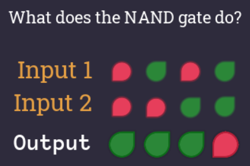

# Basic Logic

## Crude Awakening

> A signal flows from the input to the output.

The first level teaches us that when activating the input, the signal will flow to the output.

## NAND Gate

We learn about the first logic gate! It's called the `NAND` gate. Everything in a computer can be constructed from this gate. In this level we have to find out how the two input bits influence the output.

A `NAND` gate always returns `true` except when both inputs are 1. This is the truth table:

| A   | B   | Out |
| --- | --- | --- |
| 0   | 0   | 1   |
| 0   | 1   | 1   |
| 1   | 0   | 1   |
| 1   | 1   | 0   |

