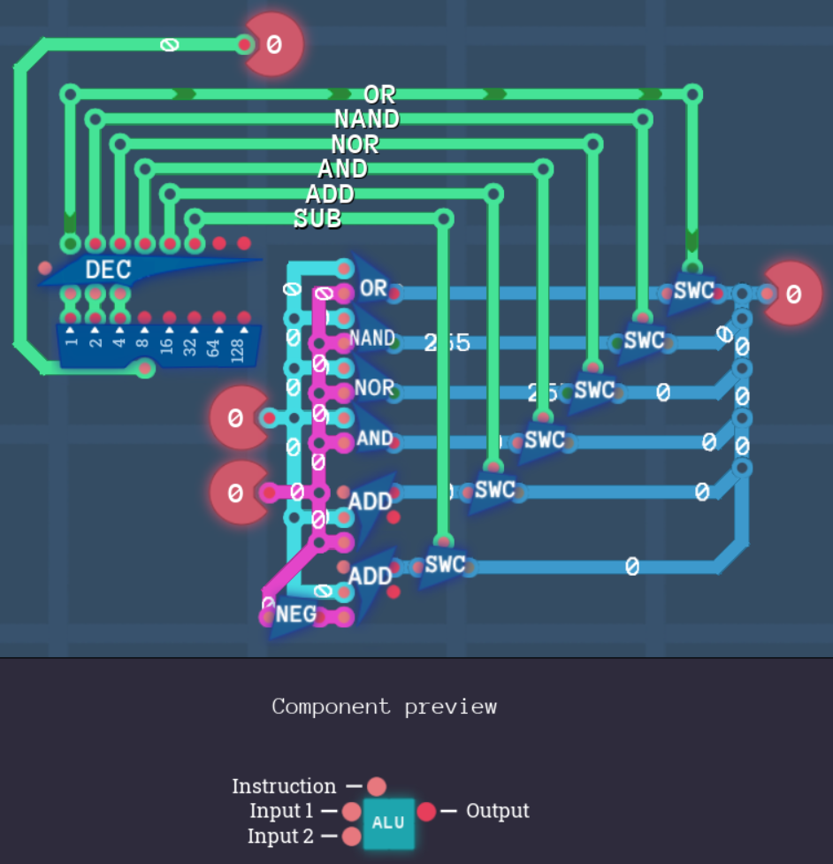

# CPU Architecture

## Arithmetic Engine

In this level we will expand on the [logic engine](Arithmetic.md#logic-engine) we've built earlier. We already implemented the logical operations like `OR`, `NAND`, `NOR` and `AND`. In this lesson we will add `ADD` and `SUB` or addition and subtraction.

### Instructions

| Code | Instruction |
| ---- | ----------- |
| 000  | `OR`        |
| 001  | `NAND`      |
| 010  | `NOR`       |
| 011  | `AND`       |
| 100  | `ADD`       |
| 101  | `SUB`       |

We could just add two additional `MUX` components but I decided to redo the whole engine. It will be easier to comprehend. This is because now we have some 8-bit components we didn't have when we built the original logic engine. So instead of using `OR` and `NOT` gates to create `NAND`, `NOR` and `AND` we will just use the designated components:

As you maybe noticed we use 3-bits for our instructions. To make the component cleaner, let's use the **3 Bit Decoder** component and switch on the signal of the appropriate instruction:

We can connect all wires to output because we are using switches, remember? :)

Now we have implemented exactly the same logic as we did in [logic engine](Arithmetic.md#logic-engine). But we have 2 new instructions: `ADD` and `SUB`.

`ADD`: Add two 8-bit numbers together
`SUB`: Subtract 8-bit number (Input 2) from 8-bit number (Input 1)

If you think about it, subtracting is like addition but with a negative Input 2. We can easily negate Input 2 and then "add" it to Input 1:

## Component Factory

We get to know a new tool: The **Component Factory**! All the circuits we create in here will be usable as components in other levels.

This level is not an assignment so we don't have to do anything here. But let's take a look at the **Aritmehtic Engine** component we created in the last level. Click above on _Switch schematic_ and choose _ALU_ (for: Arithmetic Logic Unit). That's what the component looks like:

It's not bad and mainly for optics but we can make our **ALU** smaller and nicer by aligning the components to the grid in the background.

Ah, this is much better. Now you can see your small pretty **ALU** in the _CUSTOM_ tab on the right.
