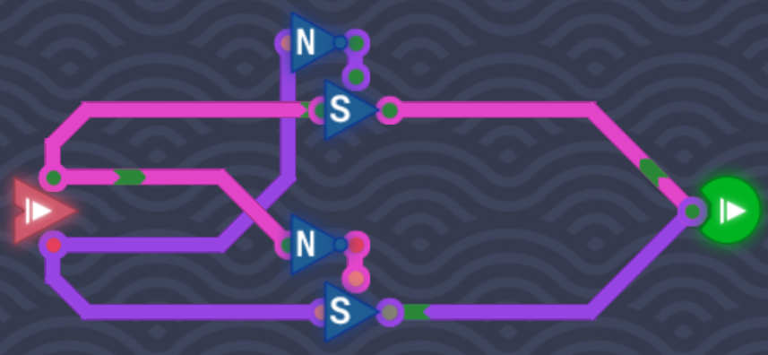
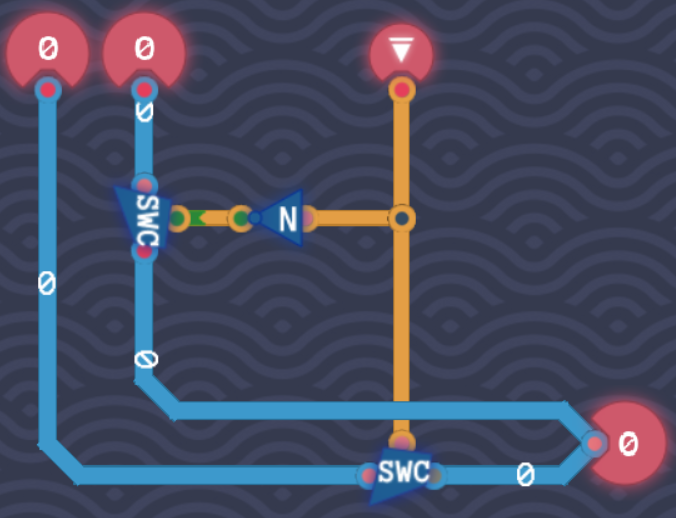
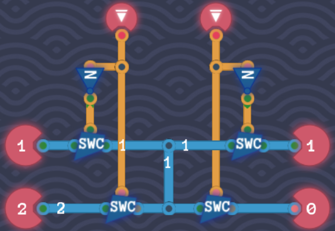
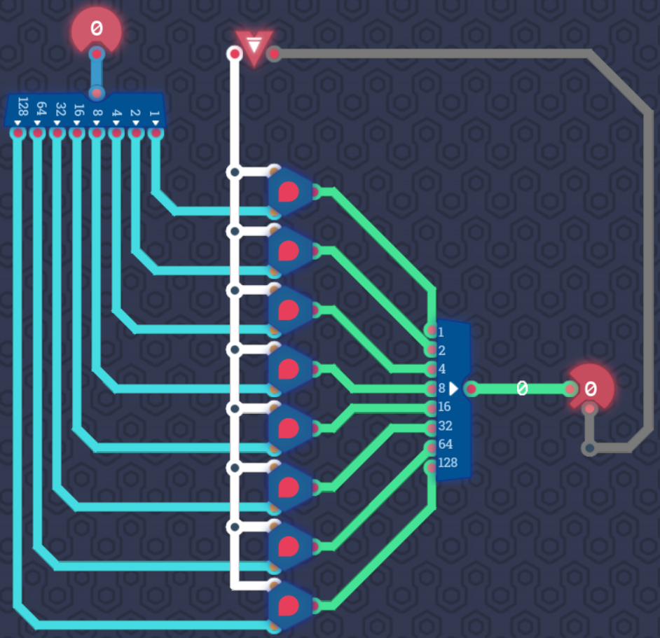

# Memory

## Circular Dependency

> Make a circuit where the input of a component depends on its own output

## Delayed Lines

In this level we get a new component: the **Delay Line** component. It takes its input and outputs it one tick later. The assignment is to delay the output by two ticks.

All we have to do is chain two **Delay Line** components together. The input signal is delayed by two ticks before it reaches the output.

## Odd Ticks

In this level we learn that when using the **Delay Line** component, it is acceptable to have a circular dependency. This is because the input does not influence the rest of the circuit until next tick.

To test this we can use a **Delay Line** and connect its output to its own input before outputting it to the **Output** component. Before connecting it to its input we use a `NOT` gate to invert the input. This way, the output is only **1** when the tick is odd.

| Tick | Output |
| ---- | ------ |
| 0    | 0      |
| 1    | 1      |
| 2    | 0      |
| 3    | 1      |
| 4    | 0      |
| 5    | 1      |

## Bit Inverter

Two 1-bit inputs are given in this level:

**Value**: 0 or 1
**Invert**: No (0) or Yes (1)

Let's look at the truth table:

### Bit Inverter Truth Table

| Value | Invert | Out |
| ----- | ------ | --- |
| 0     | 0      | 0   |
| 1     | 0      | 1   |
| 0     | 1      | 1   |
| 1     | 1      | 0   |

The truth table looks exactly the same as the `XOR` truth table. So all we have to do is connecting both inputs to an `XOR` gate.

## Bit Switch

The assignment in this level is to create an `XOR` gate from two **Bit Switch** components and two `NOT` gates.

The **Bit Switch** component only outputs a signal when it is enabled. This means we can connect components which output different values on the same wire without getting an error.

When the top pin is **0** the output is disabled. The **Bit Switch** output will be gray meaning it does not emit any signal. We can connect as many switches and wires as we want as long only one of them is enabled at a time.

The logic is simple:

1. If **A** is 1, disable **B**
2. If **B** is 1, disable **A**

We achieve this by taking the signal of the disabled input which is **0**, then invert it and pass it to the switch of the enabled input. This way we allow the signal to flow through the **Bit Switch** only of the enabled input.

## Input Selector

We get three inputs: Two 8-bit numbers and a 1-bit **value** input. If the 1-bit **value** is **0**, select input **A**, otherwise **B**.

| Value | Out |
| ----- | --- |
| 0     | A   |
| 1     | B   |

When you take a look at the 8-bit components, you find in it an **8 Bit Switch**. This component allows us to take an 8-bit input and output it if the 1-bit **enable** pin is enabled (meaning **1**). Otherwise nothing will be outputted.

1. Connect the two binary numbers to the output. This will emit an error because we cannot write to the same wire at the same time.
2. Put on each wire an **8 Bit Switch**.
3. If **value** is **0** we invert the bit with a `NOT` gate and connect it to the switch for input **A**.
4. If **value** is **1** we connect it to the switch for input **B**.

This ensures that only one signal is emitted at a time to the same wire and the correct number will be outputted.

## The Bus

> In computer architecture, a bus (historically also called a data highway[1] or databus) is a communication system that transfers data between components inside a computer or between computers.

In this level we have the following elements:

1. A 1-bit input: **FROM**, determines which input we should copy from (**Input 1** or **Input 2**)
2. A 1-bit input: **TO**, determine which output we should copy to (**Output 1** or **Output 2**)
3. 2 8-bit input: **Input 1** and **Input 2**
4. 2 8-bit output: **Output 1** and **Output 2**

We've learned in the previous levels that we can use the same wire for all inputs and outputs as long as only one signal is emitted at a time. That's why we need **8 Bit Switch**es.

- If **FROM** is 0, then let the signal from **Input 1** pass, otherwise **Input 2**.
- If **TO** is 0, then let the signal pass to **Output 1**, otherwise **Output 2**.

## Saving Gracefully

We've learned that with the **Delay Line** component, we can save a 1-bit value for one tick. But what if we want to store a value until we overwrite it?

We get two inputs:

1. A 1-bit input: **ACTION**, **0** is DON'T SAVE and **1** is SAVE
2. A 1-bit input: **VAlUE**

The output shows the saved value from the last tick (output of **Delay Line**). It keeps this value until it is overwritten with a value in **VALUE** when **ACTION** is **1** (SAVE).

Let's first connect **VALUE** to a **Delay Line** which then outputs the signal after one tick. How do we make this persistent?

We only want the **VALUE** signal to pass the **Delay Line** if **ACTION** is **1** (SAVE). For that we can use a **Switch** to conditionally emit the signal only if **ACTION** is **1**.

Next, if **ACTION** is **0**, we want to instead output the **VALUE** of the last tick again. To achieve this, let's redirect the output from the **Delay Line** to its own input. This way the next tick the output will be the same value as the current tick.

We also have to ensure that **ACTION** is **0**, otherwise we overwrite **VALUE** and don't want to output the value of the last tick. To ensure this, we take the **ACTION** signal and invert it, then connect it to a switch which controls the wire which feeds into **Delay Line**. This ensures that the signal passed from **Delay Line** to itself is only active when **ACTION** is **0** (DON'T SAVE). That's why we invert it so we can use it in a switch which enables this wire.

## Saving Bytes

We successfully saved one single bit in the [last level](#saving-gracefully). Usually, a single bit isn't too useful on its own though. In this level we save a whole byte.

We have two 1-bit inputs:

1. **Input 0**: If **0**, don't load the value (output it), otherwise load it
2. **Input 1**: If **0**, don't save the value, otherwise save it

Also we get a 8-bit binary number. This will be the number we have to save (if **Input 1** is on). In addition, we get to use the component we've built last in the last level: The **1 Bit Memory** component.

Please note, that the **Output** component has an additional pin (on the bottom). This pin enables the input when there is a signal, otherwise nothing is outputted (0).

Basically we do exactly the same as in [Saving Gracefully](#saving-gracefully), but this time with 8 bits. So we split the byte into 8-bits using the **Byte Splitter** component. Then for each bit we use a **1 Bit Memory** component to store the bit inside. And then passing it to the **8 Bit Maker** which turns the 8 bits back into a byte.

Also, we connect **Input 0** to the **enable** pin in the **Output** component. This means, only when **LOAD** (1) is set we want to output a number.

Then we connect **Input 1** to all of the **1 Bit Memory** "**Save enable**" pins. This is to ensure that only bits get saved when **Input 1** is **1** (SAVE).

